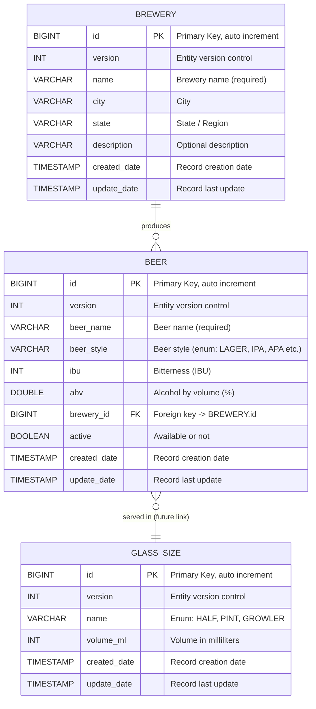

# MS Product Catalog (`catalog-service`)

Responsável por gerenciar cervejas, categorias, estilos e cervejarias.

---

## Entidades

### Beer (Cerveja)

| Campo         | Tipo          | Descrição                                                                                 | Exemplo                     |
|:--------------|:--------------|:------------------------------------------------------------------------------------------|:----------------------------|
| `id`          | Long (PK)     | Chave primária. Identificador único da Cerveja. Auto generated                            | `1`                         |
| `version`     | Integer       | Versão                                                                                    | `1`                         |
| `beerName`    | String        | Nome da cerveja (obrigatório)                                                             | `KATANA`                    |
| `beerStyle`   | String (Enum) | Estilo da Cerveja: LAGER, PILSNER, STOUT, GOSE, PORTER, ALE, WHEAT, IPA, PALE_ALE, SAISON | `IPA`                       |
| `ibu`         | Integer       | International Bitterness Units, o nível de amargor do chope.                              | `71`                        |
| `abv`         | Double        | O percentual de álcool por volume (ABV).                                                  | `7.3`                       |
| `breweryId`   | Long (FK)     | Chave estrangeira. Referência: `brewery.id`                                               | `2`                         |
| `active`      | Boolean       | Indica se está disponível ou não                                                          | `true`                      |
| `createdDate` | LocalDateTime | Data do Cadastro                                                                          | `2025-10-17T16:17:59-03:00` |
| `updateDate`  | LocalDateTime | Data da última atualização                                                                | `2025-10-17T16:17:59-03:00` |

### Brewery (Cervejaria)

| Campo         | Tipo          | Descrição                                                      | Exemplo                             |
|:--------------|:--------------|:---------------------------------------------------------------|:------------------------------------|
| `id`          | Long (PK)     | Chave primária. Identificador único da Cerveja. Auto generated | `2`                                 |
| `version`     | Integer       | Versão                                                         | `1`                                 |
| `name`        | String        | Nome da cervejaria (obrigatório)                               | `KOHZAN`                            |
| `citye`       | String        | Cidade                                                         | `Curitiba`                          |
| `state`       | String        | Estado ou Região                                               | `PR`                                |
| `description` | String        | Descrição (opcional)                                           | `Cervejaria artesanal independente` |
| `createdDate` | LocalDateTime | Data do Cadastro                                               | `2025-10-17T16:17:59-03:00`         |
| `updateDate`  | LocalDateTime | Data da última atualização                                     | `2025-10-17T16:17:59-03:00`         |

### GlassSize (Tamanho do Copo)

| Campo         | Tipo          | Descrição                                                      | Exemplo                     |
|:--------------|:--------------|:---------------------------------------------------------------|:----------------------------|
| `id`          | Long (PK)     | Chave primária. Identificador único da Cerveja. Auto generated | `3`                         |
| `version`     | Integer       | Versão                                                         | `1`                         |
| `name`        | String (Enum) | Tipo de Copo: half, pint, growler (obrigatório)                | `Pint`                      |
| `volumeMl`    | Integer       | Volume em mililitros (obrigatório)                             | `473`                       |
| `createdDate` | LocalDateTime | Data do Cadastro                                               | `2025-10-17T16:17:59-03:00` |
| `updateDate`  | LocalDateTime | Data da última atualização                                     | `2025-10-17T16:17:59-03:00` |

---

## Entity Relationship Diagram

### Descrição das Relações

| Entidade              | Relacionamento | Tipo                                                                         | Descrição |
|-----------------------|----------------|------------------------------------------------------------------------------|-----------|
| `BREWERY` → `BEER`    | 1:N            | Uma cervejaria produz várias cervejas                                        |           |
| `BEER` → `GLASS_SIZE` | N:1 (futuro)   | Cada cerveja pode ter tamanhos servidos distintos (extensível para Tap List) |           |

### Possíveis futuras extensões

| Nova entidade        | Finalidade                                                  | Relacionamentos                     |
|----------------------|-------------------------------------------------------------|-------------------------------------|
| `tap_list`           | Catálogo de cervejas disponíveis em tempo real              | `beer_id`, `glass_size_id`, `price` |
| `beer_price_history` | Histórico de preços da cerveja                              | `beer_id`                           |
| `beer_style_enum`    | Tabela de estilos pré-definidos (opcional, se não for enum) | `beer.beer_style`                   |

---

