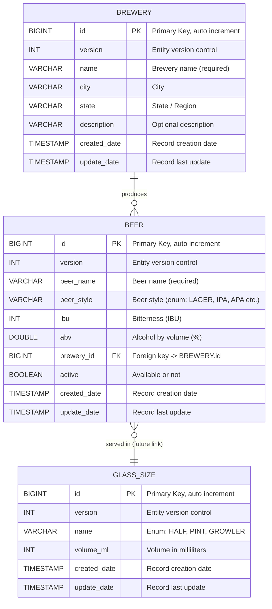

# MS Product Catalog (`catalog-service`)

Responsável por gerenciar cervejas, categorias, estilos e cervejarias.

---

[Saiba mais na Wiki do MS Catalog Service](https://github.com/JuhMaran/catalog-service/wiki)

## Database

* Schema: `catalog_db`
* Tables:
    * `beer`
    * `brewery`
    * `glass_size`

### Beer (Cerveja)

| Campo         | Tipo          | Descrição                                                                                 | Exemplo                     |
|:--------------|:--------------|:------------------------------------------------------------------------------------------|:----------------------------|
| `id`          | Long (PK)     | Chave primária. Identificador único da Cerveja. Auto generated                            | `1`                         |
| `version`     | Integer       | Versão                                                                                    | `1`                         |
| `beerName`    | String        | Nome da cerveja (obrigatório)                                                             | `KATANA`                    |
| `beerStyle`   | String (Enum) | Estilo da Cerveja: LAGER, PILSNER, STOUT, GOSE, PORTER, ALE, WHEAT, IPA, PALE_ALE, SAISON | `IPA`                       |
| `ibu`         | Integer       | International Bitterness Units, o nível de amargor do chope.                              | `71`                        |
| `abv`         | Double        | O percentual de álcool por volume (ABV).                                                  | `7.3`                       |
| `breweryId`   | Long (FK)     | Chave estrangeira. Referência: `brewery.id`                                               | `2`                         |
| `active`      | Boolean       | Indica se está disponível ou não                                                          | `true`                      |
| `createdDate` | LocalDateTime | Data do Cadastro                                                                          | `2025-10-17T16:17:59-03:00` |
| `updateDate`  | LocalDateTime | Data da última atualização                                                                | `2025-10-17T16:17:59-03:00` |

### Brewery (Cervejaria)

| Campo         | Tipo          | Descrição                                                      | Exemplo                             |
|:--------------|:--------------|:---------------------------------------------------------------|:------------------------------------|
| `id`          | Long (PK)     | Chave primária. Identificador único da Cerveja. Auto generated | `2`                                 |
| `version`     | Integer       | Versão                                                         | `1`                                 |
| `name`        | String        | Nome da cervejaria (obrigatório)                               | `KOHZAN`                            |
| `citye`       | String        | Cidade                                                         | `Curitiba`                          |
| `state`       | String        | Estado ou Região                                               | `PR`                                |
| `description` | String        | Descrição (opcional)                                           | `Cervejaria artesanal independente` |
| `createdDate` | LocalDateTime | Data do Cadastro                                               | `2025-10-17T16:17:59-03:00`         |
| `updateDate`  | LocalDateTime | Data da última atualização                                     | `2025-10-17T16:17:59-03:00`         |

### GlassSize (Tamanho do Copo)

| Campo         | Tipo          | Descrição                                                      | Exemplo                     |
|:--------------|:--------------|:---------------------------------------------------------------|:----------------------------|
| `id`          | Long (PK)     | Chave primária. Identificador único da Cerveja. Auto generated | `3`                         |
| `version`     | Integer       | Versão                                                         | `1`                         |
| `name`        | String (Enum) | Tipo de Copo: half, pint, growler (obrigatório)                | `Pint`                      |
| `volumeMl`    | Integer       | Volume em mililitros (obrigatório)                             | `473`                       |
| `createdDate` | LocalDateTime | Data do Cadastro                                               | `2025-10-17T16:17:59-03:00` |
| `updateDate`  | LocalDateTime | Data da última atualização                                     | `2025-10-17T16:17:59-03:00` |

---

## Entity Relationship Diagram



### Descrição das Relações

| Entidade              | Relacionamento | Tipo                                                                         | Descrição |
|-----------------------|----------------|------------------------------------------------------------------------------|-----------|
| `BREWERY` → `BEER`    | 1:N            | Uma cervejaria produz várias cervejas                                        |           |
| `BEER` → `GLASS_SIZE` | N:1 (futuro)   | Cada cerveja pode ter tamanhos servidos distintos (extensível para Tap List) |           |

### Possíveis futuras extensões

| Nova entidade        | Finalidade                                                  | Relacionamentos                     |
|----------------------|-------------------------------------------------------------|-------------------------------------|
| `tap_list`           | Catálogo de cervejas disponíveis em tempo real              | `beer_id`, `glass_size_id`, `price` |
| `beer_price_history` | Histórico de preços da cerveja                              | `beer_id`                           |
| `beer_style_enum`    | Tabela de estilos pré-definidos (opcional, se não for enum) | `beer.beer_style`                   |

### Resumo das Relações

| Relacionamento        | Tipo             | Descrição                                                                         |
|-----------------------|------------------|-----------------------------------------------------------------------------------|
| `BREWERY` → `BEER`    | **1:N**          | Uma cervejaria pode produzir várias cervejas                                      |
| `BEER` → `GLASS_SIZE` | **N:1 (futuro)** | Cada cerveja pode ser servida em diferentes tamanhos de copo (extensão planejada) |

### Versionamento Flyway

| Ambiente | Diretório             | Banco               |
|----------|-----------------------|---------------------|
| `dev`    | `/db/migration/h2`    | H2 (memória)        |
| `prod`   | `/db/migration/mysql` | MySQL (persistente) |

---

## Estrutura de Diretórios

### Estrutura para '/src/main/java'

```
com.taptrack.catalogservice
 ├── application/
 │    ├── controller/               # @RestController
 │    └── dto/                      # @Builder (records)
 │         ├── request/
 │         └── response/
 ├── domain/                        
 │    ├── model/                    # @Entity
 │    ├── repository/               # @Repository
 │    └── service/                  
 │         └── impl/                # @Service / @SLF4J
 ├── infrastructure/
 │    ├── client/                   # OpenFeign
 │    ├── config/                   # @Configuration
 │    └── persistence/              # JPA
 └── CatalogServiceApplication.java
```

### **Padrões Utilizados**

| Categoria            | Padrão                                  | Descrição                                                 |
|----------------------|-----------------------------------------|-----------------------------------------------------------|
| Estrutura de pacotes | **Domain-Driven Design (DDD)**          | Separação clara entre domínio, aplicação e infraestrutura |
| Comunicação          | **Spring Cloud OpenFeign**              | Comunicação REST tipada entre serviços                    |
| DTO Mapping          | **MapStruct**                           | Conversão entre entidades e DTOs                          |
| Persistência         | **Spring Data JPA**                     | Repositórios e queries automáticas                        |
| Configuração         | **@ConfigurationProperties** + Profiles | Isolamento de ambientes                                   |
| Log                  | **SLF4J + Logback**                     | Logs estruturados e coloridos                             |
| Docs                 | **SpringDoc OpenAPI 3**                 | Geração automática de Swagger UI                          |

### Estrutura para '/src/main/resources'

```
src
└── main
    └── resources
        └── db
            └── migration
                ├── h2                                      # H2 Database - ambiente de desenvolvimento (dev)
                │   ├── V001__create_brewery_table.sql
                │   ├── V002__create_glass_size_table.sql
                │   └── V003__create_beer_table.sql
                └── mysql                                   # MySQL - ambiente de produção (prod)
                    ├── V001__create_brewery_table.sql
                    ├── V002__create_glass_size_table.sql
                    └── V003__create_beer_table.sql
```

* **Flyway migra automaticamente** com base nos diretórios `db/migration/{profile}` definidos no `application.yml`.
* As tabelas possuem **timestamps automáticos** de criação e atualização.
* O `glass_size` é **pré-populado** com 3 tamanhos padrões.
* As colunas estão em **snake_case** e todos os nomes de entidades/tableas estão em **inglês**.

---

## REST Endpoints

| Method | Endpoint      | Description       |
|--------|---------------|-------------------|
| GET    | `/beers`      | List all beers    |
| GET    | `/beers/{id}` | Get beer details  |
| GET    | `/breweries`  | List breweries    |
| POST   | `/beers`      | Create a new beer |

---

## Explicação sobre Propriedades (application)

| Seção                             | Função                                                                     |
|-----------------------------------|----------------------------------------------------------------------------|
| **`spring.profiles.active`**      | Controla o perfil ativo (pode ser alterado por variável de ambiente).      |
| **`eureka.instance.instance-id`** | Usa nome, perfil e porta para evitar conflitos.                            |
| **`logging.pattern.console`**     | Define saída colorida e legível dos logs no terminal.                      |
| **`application-dev.yml`**         | Usa **H2** e ativa o console `/h2-console` para desenvolvimento.           |
| **`application-prod.yml`**        | Usa **MySQL** e lê scripts do diretório `/db/migration/mysql`.             |
| **`flyway.baseline-on-migrate`**  | Permite rodar migrações mesmo em bancos existentes.                        |
| **`management.endpoints`**        | Expõe `health`, `info` e `metrics` para observabilidade (Prometheus, etc). |

---

## Observações

* Uso do `Optional`: utilizado para retornos de busca exata e evitar `null`.
* Métodos como `findByBeerNameContainingIgnoreCase` facilitam buscas parciais, como digitar “IPA” e retornar todas as
  cervejas com IPA no nome.
* `BeerRepository` permite buscar por cervejaria via `breweryName` usando Spring Data derived query.
* `@Mapper(componentModel = "spring")` permite injetar os mappers via `@Autowired`
* `updateFromRequest` permite **autlização parcial** de uma entidade com dados do DTO.
* Todos os DTOs usam `record` para **imutabilidade** e `@Builder` do Lombok para facilidade de construção.
* `BeerResponse` retorna `breweryId` apenas, evitando exposição direta do objeto `Brewery`.